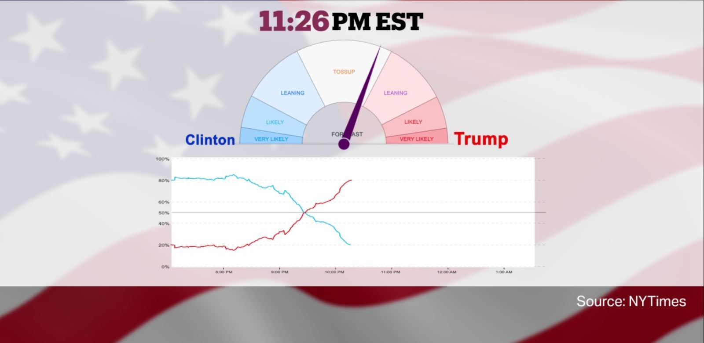

The goal of this project is to predict final, state-wide results as county level results stream in on election night. Essentially, we’re recreating the New York Times election night needle.

The below graphic, on the left, shows how counties report in the 2022 Georgia Senate election. The order of counties reporting tends to skews election results. If liberal counties report early, the phenomenon is sometimes referred to as the right hook. This notoriously happens in Florida, as early results make it seem as though democrats have secured victory, only to get hit with a right hook from late reporting counties from the conservative panhandle.

The below graphic, on the right, shows how within a county, results get more Republican as counting progresses. Counts of in-person votes are more likely than overall vote counts to be for the Republican Party, while mail-in votes, and early in-person votes, which are often counted first, tend to be more Democrat.

Our Election Night Margin model is composed of two parts to account for the two phenomenons  

1. intra-county election prediction model - a regression model that predicts final county results based on early returns
2. inter-county election prediction model - a mixed-effects model that predicts final, state-wide results for all counties based only on counties that have reported.

In [part one](./Predicting_Election_Night_Margin_1.ipynb) we build the intra-county election prediction model, and in [part two](./Predicting_Election_Night_Margin_2.ipynb) we continue our work and construct the inter-county election model. We combine both the intra-county and inter-county models in [part three](./Predicting_Election_Night_Margin_3.ipynb) to build our comprehensive election model. 
